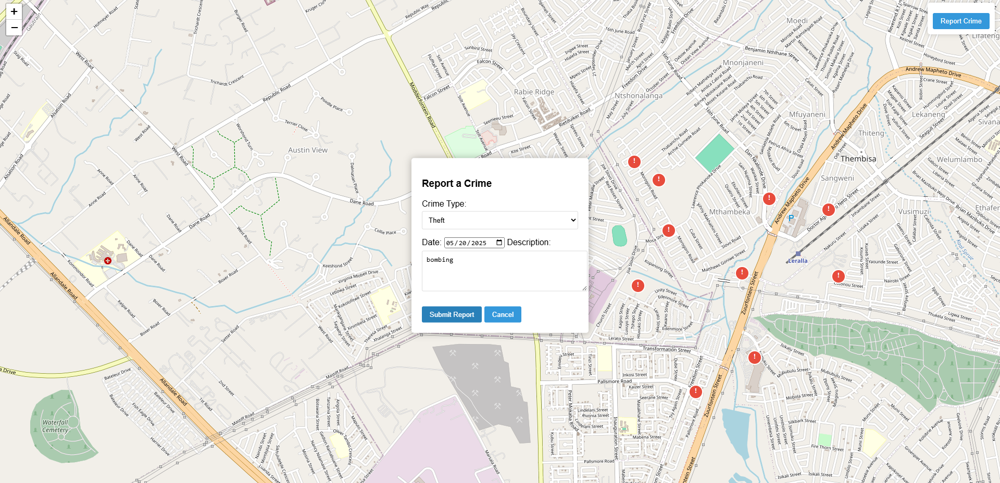

# Crime Reporting Map Application

## Overview

A web-based application that allows community members to report and visualize crime incidents on an interactive map. Users can add pins to mark locations where crimes have occurred, with details about the incident type, date, and description.

## Features

-  Interactive map using OpenStreetMap and Leaflet.js
-  Add crime reports with custom markers
-  View crime details in popup windows

## Technologies Used

- **Frontend**:
  - HTML5, CSS3, JavaScript
  - [Leaflet.js](https://leafletjs.com/) - Lightweight mapping library
  - OpenStreetMap - Free open-source map tiles

## Installation

No installation required for the basic version - just open the HTML file in a browser. For development:

1. Clone this repository

2. Open `index.html` in your preferred web browser.

## Usage

1. Click "Report Crime" button to start reporting
2. Click on the map where the incident occurred
3. Fill in the crime details:
   - Select crime type from dropdown
   - Enter date of incident
   - Add description (optional but recommended)
4. Click "Submit Report" to add the marker to the map
5. Click on any marker to view crime details

## Future Enhancements
I did not implement a backend database to store and retrieve reported incidents
in the near future I will implement this feature using local storage
- [ ] Backend database integration

## Contributing

Contributions are welcome!

## License

Distributed under the MIT License. See `LICENSE` for more information.

Project Demo: [Live Demo](https://crimemapp.netlify.app/)

---
